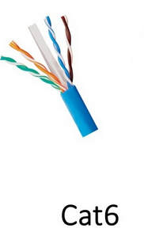
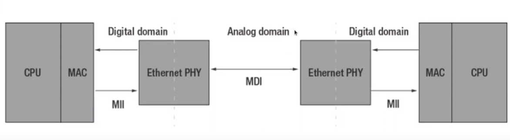
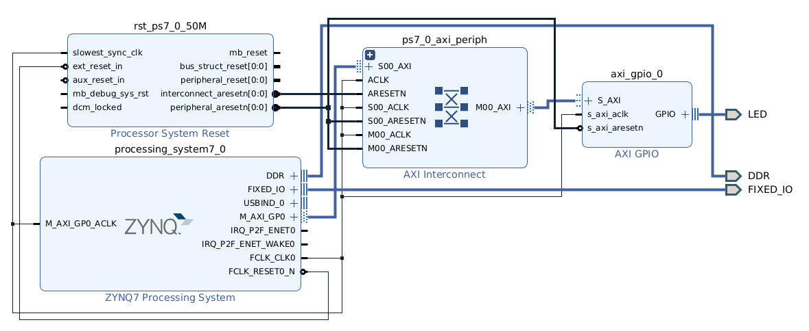
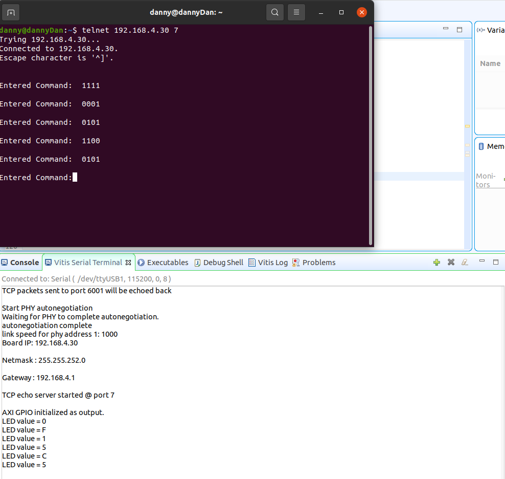
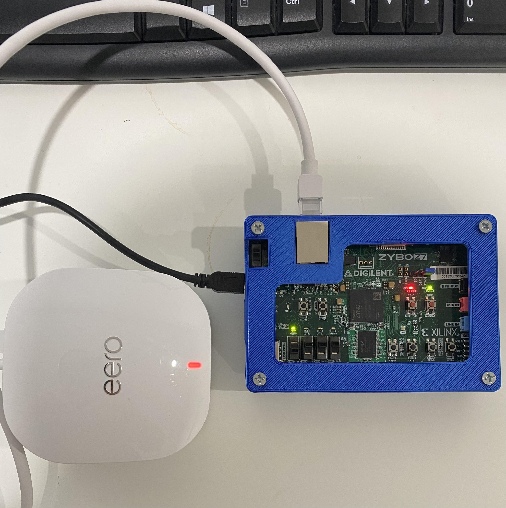

                                       Spring 2022
                      California State University, Northridge    
                     Department of Electrical & Computer Engineering

_______ 
________________________________________ __________________________________________

                                         Final Project
                                          Ethernet Led
                                    Professor: Saba Janamian
                                       Date: 05/17/2022
                            ECE 520(System on Chip Design and Laboratory)
                                        Daniel Poghosyan 

                         Control Leds With Ethernet Communication Protocol 

In this project we are controlling the LEDs of the ZYBO Z10 board through Ethernet communication protocol using TCP/IP model. There are four basic building blocks that an Ethernet system consists of. The Ethernet frame, Media Access Control(MAC), Signaling components and Physical medium(PHY). The Ethernet frame has a structure in which it uses to carry bits over the system. The MAC is a multiplexer type control block which allows multiple systems to access the Ethernet channel. THe Signaling Component is used to send and receive signals over the Ethernet channel (RX and TX) data. And the PHY is an actual chip that interfaces between the digital and analog domains. There are two network models for different networks to communicate with each other OSI and TCP/IP. In this application we used the TCP/IP model for the Ethernet communication protocol. 

TCP/IP 
--

                             
                                      
Fig 1.1           Fig 1.2

The Physical layer of the TCP/IP defines how data should be sent physically through different network mediums such as coaxial, optical, twisted-pair cables. For our application we used twisted-pair cables called Cat 6 shown in Figure 1.3. The Data Link layer converts the raw data bits coming from the physical layer and turns them into pockets. This layer is known as the MAC address layer. In the Network layer we assign the IP address to different devices. It is in this layer that the router has information about different devices' addresses based on its IP address table. This is where the router routes packets accurately to different devices. The Transport  layer's job is to make sure the messages that arrive to this layer are without errors and are delivered to the correct destinations.And the Application  layer interacts with an application program, with software applications to implement a communication. 

 
Fig 1.0 

The communication between the eero router and the ZYBO Z10 board is shown in figure 1.0. The right side represents the eero router. It consists of the Ethernet PHY, MAC and CPU. On the left side we have the ZYBO Z10 board. In the middle we have the MDI and MDI stands for medium dependent interface. This interface is in the analog domain and for our application the MDI is a  CAT6 cable, which is a cable connection between the router and the board.  Both the eero router and ZYBO board have digital and domains. ZYBO’s Ethernet PHY has two interfaces: digital and analog domains. In the analog domain it receives analog data with CAT6 cable. Once it receives the data it then converts it to digital data and serves it to the digital interface though MII.MII stands for Medium inodent interface. This is Where the MAC accepts the data digital data un packages it and serves it to the ZEEBO's CPU.   

## Vivado 
-----

Fig 1.3

IN Vivado we bring in a Zynq processor and run an auto connection which creates the external off-chip DDR and FIXED_IO ports. Inside Zynq’s configurations we make sure we have ENET 0 and UART 1 selected. In vivado we used a regular GPIO IP provided by Vivado and for the board interface selected leds 4bits. We ran auto-connection one more time and this time it created the block design shown in figure 1.3. With AXI interconnect created between the ZYNQ ps and the GPIO IP on the PL side. The master M_AXI_GP0 connects to S00_AXI or AXI interconnect. And the M00_AXI of AXI interconnect will be connected to the S_AXI of GPIO IP. And the external LED coming out of the GPIO is connected to the 4 LEDs of the ZYBO z10 board. M14, M15,G14,D18. LD0-L3. Once we are done with the design we create a wrapper, generate bitstream and export the hardware. 

## Vitis
---
In vitis we create a lwiP echo server application on the firmware previsuoly designed in vivado. In this application we are controlling the four LEDs of the ZYBO board through the ethernet communication protocol using TCP/IP model. 

We included the following header files for our project. First the <stdlib.h> defines  four variable types, several macros and various general functions. We included the  "xparameters.h" file which contains all the information about the firmware that was built in vivado. Based on the firmware design, Vivado software will allocate different memory locations for all the IPs built on the PL side of the FPGA board on the PS.. And when we export the firmware that we built with the .xsa file. On vitis all the information regarding firmware will be stored in the "xparameters.h" file. The "xil_io.h" header file was also included which contains information of the general I/O component. And the "xgpio.h" header file contains API basic functions implemented in xgpio.c file. We used initialization and setting direction functions for the LEDs. Lastly we included "lwip/err.h" and "lwip/tcp.h" which are part of the lwiP TCP/IP stack. 

In the echo.c code we created an instance of led and used a total of 7 functions to execute our application.  First we used the “void print_app_header()” function to to print on the vitis terminal the port number that the communication takes place with.Then we used the “recv_callback()” “accept_callback()” functions and  in this functions we receive and accept the data from the specific IP and perform depending on the application. In the “start_application()” we instanite the IP for the board we use. And the servers start to listen to the clients, in this case the board that wants to connect to the network.

Then inside the  “AXI_GPIO_Init()” function we initialized the GPIO IP device ID that was created on the PL side of the board and was connected to the LEDs. And set the direction of the LEDs as an output. Lastly, inside the “set_led(char cmd[4]” function we created the functionality of the code as to what it should do when it receives characters from the command terminal. Inside this code we set the led value to be zero initially and for each input cmd[0-3] we give two options. If the inputted value is one we perform a left shift operation of 3 bits and then do an “OR” operation with the led_value. If the user gives led_value of 1 for the cmd[0] then the “OR” operations result will be high and will light up the led. However, if the user inputs a zero value for cmd[0] then we still perform a left shift of 3 bits and then we invert all the bits and do a “AND” operation. This will always give a result of zero because the led_value will always be a zero. And this will not turn on the LED. THe following method is used for the rest of the 3 user imputed values. Figure 1.4 shows that with the given user input command through telnet communication protocol we first displayed the value received from the user and at the same time turned the leds on.  

Fig 1.4

Fig1.5
Figure 1.5 shows the physical communication between the eero router and ZYBO Z10 board.

https://youtube.com/shorts/Y_Hjy_WMGyw?feature=share
